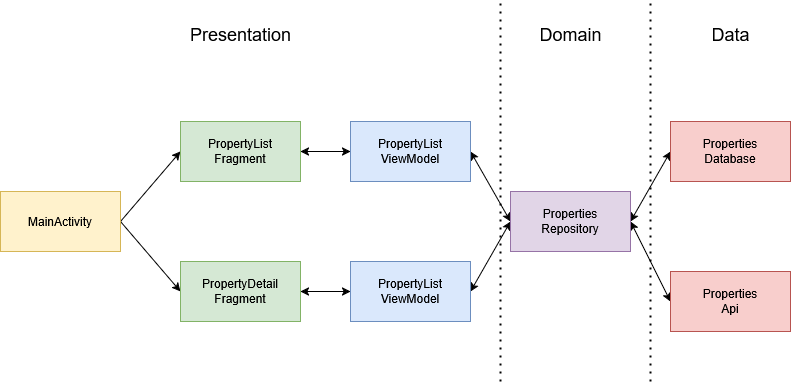
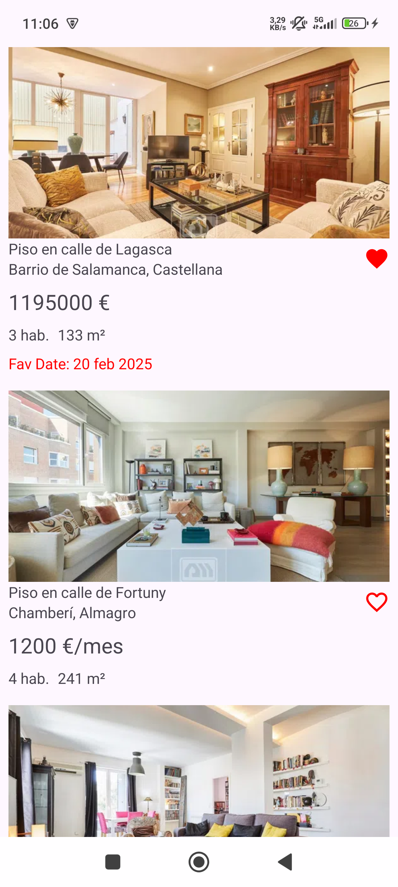
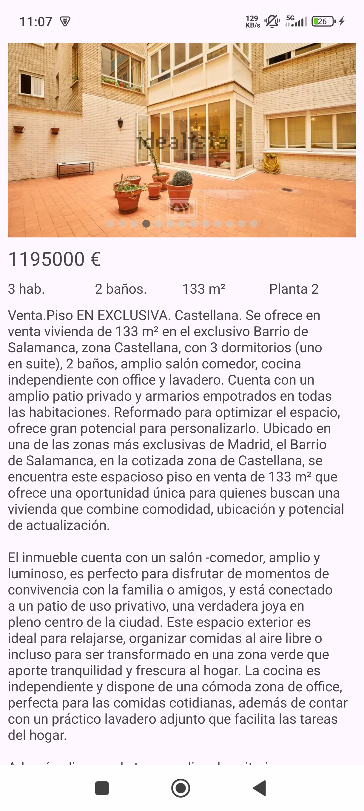

# Property Listing Challenge

An implementation of idealista's android coding challenge. The core idea is to build an app that allows users to browse through a list of ads and view ad details on a separate screen. 

The initial list of properties and the ad details are retrieved from an API. The list is then saved locally in a database for offline access and favorite ad management.

## Architecture

The solution to the challenge follows a CLEAN architecture approach, separating the classes in 3 different layers. For the presentation, a single activity architecture with NavComponent, fragments & MVVM pattern has been chosen.

The accquisition, processing or storage of data is managed by a repository that will access idealista's API or the local database as needed.
## Tech & Features

* **2 screens**: Property ads list using a recyclerview & property details screen. The details screen uses a combination of **XML Views** and **Jetpack Compose** to show a swipeable carrousel of the properties images. 
* **Persistent storage**: After the properties have been retrieved from the API for the first time they get stored locally thanks to a **Room DB**. This enables offline usage and favorite management of ads.
* **API calls**: Retrofit has been used to retrieve the list and details of the properties from the API.
* **Dependency injection**: Dagger-Hilt has been used to inject dependencies throughout the project.
* **Testing**: Unit testing for a utils class and a ViewModel & an instrumented test for the database have been added as examples of various kinds of testing.

   

